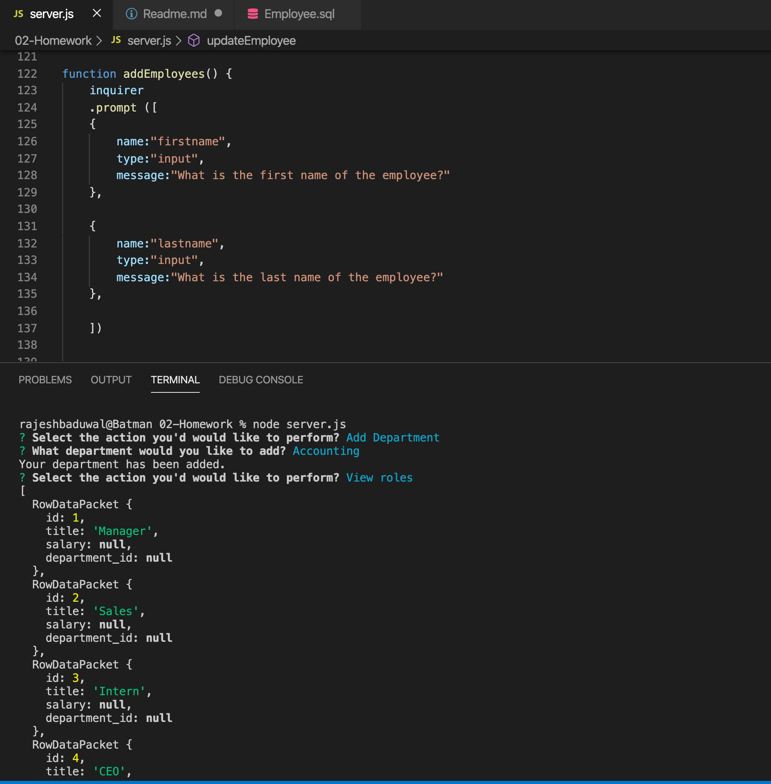

# Employee Tracker
A Command Line Interface application that allows user to build a custom engineering team. 

## Description
The Employee-Tracker application allows users to view, add, update and remove employee information from the database.This application is built using Node.js, JavaScript, and Mysql.  

## Challenges
Understanding the MySql queries in JavaScript was a challenge for this project.

## Screenshot

